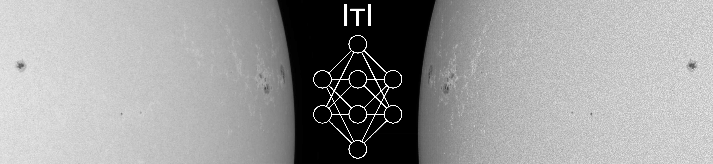
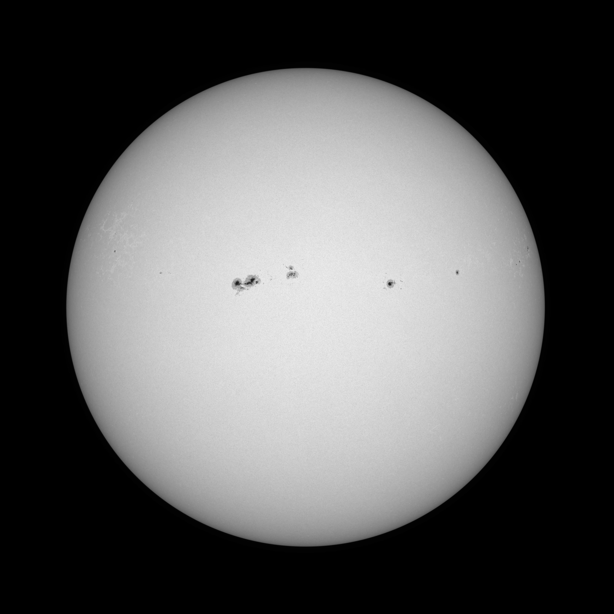
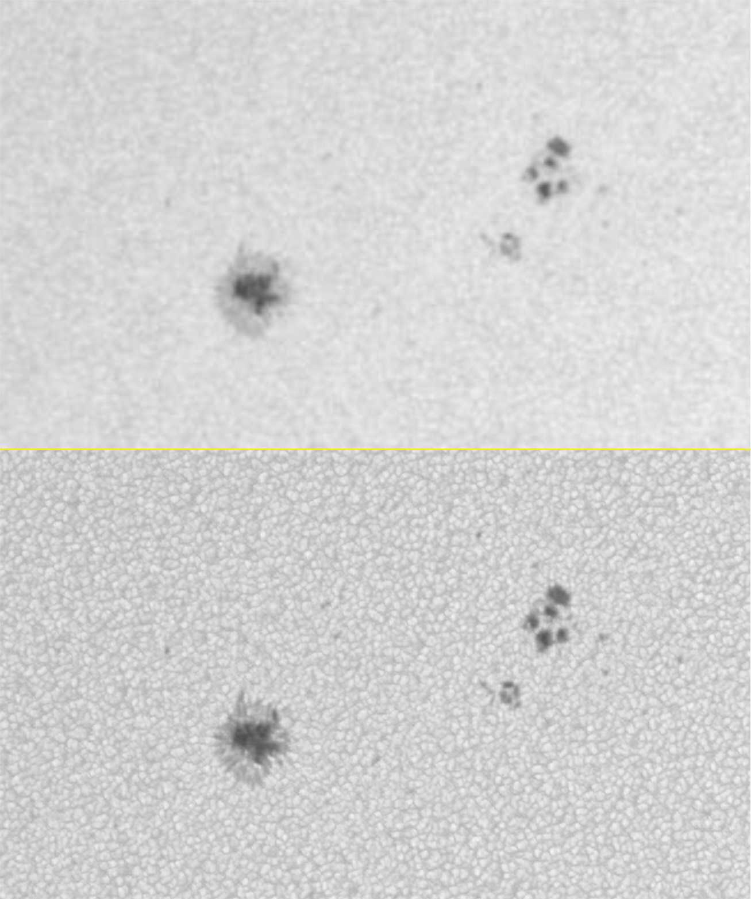
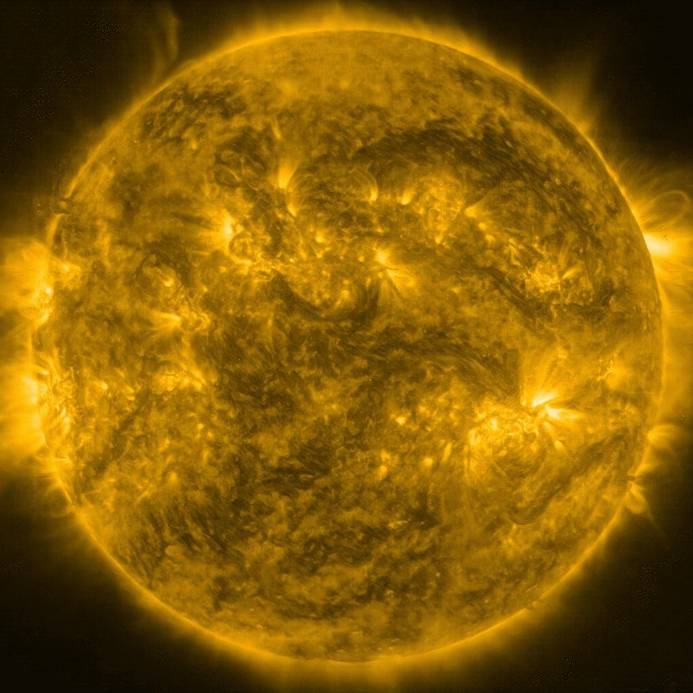
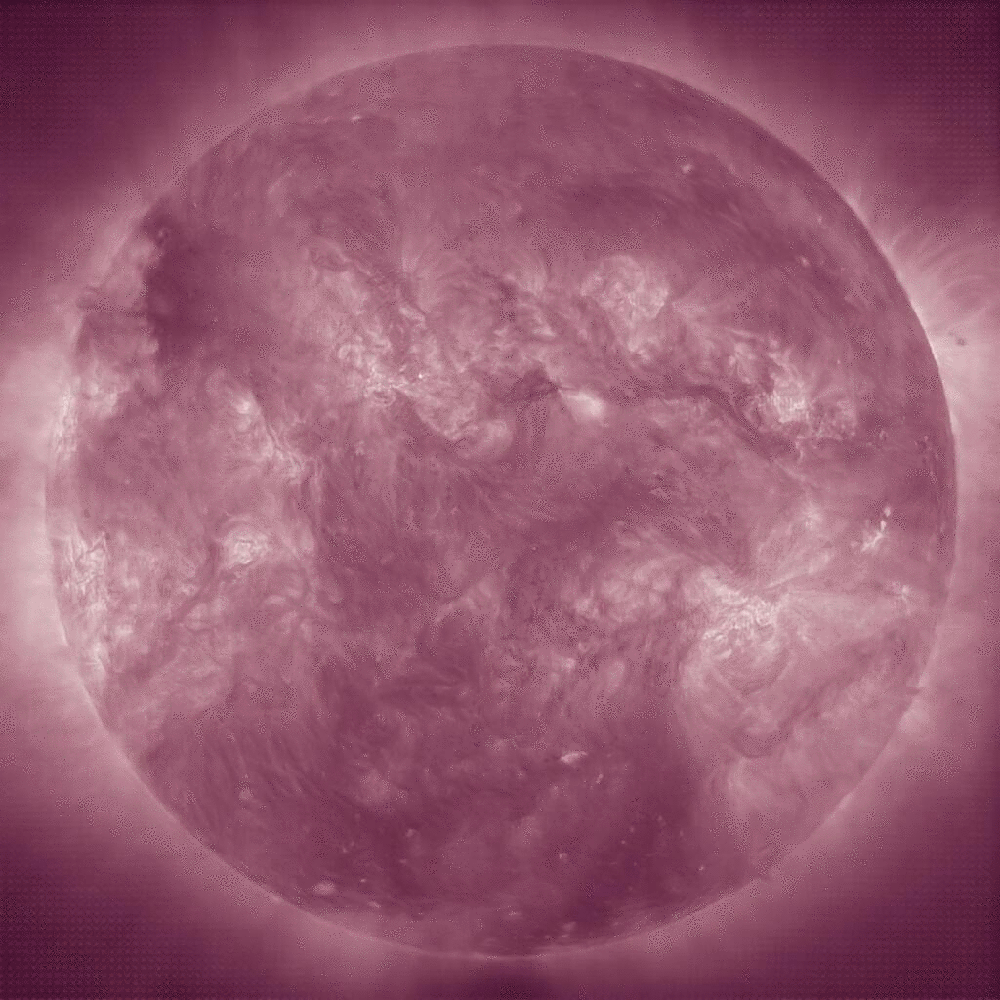
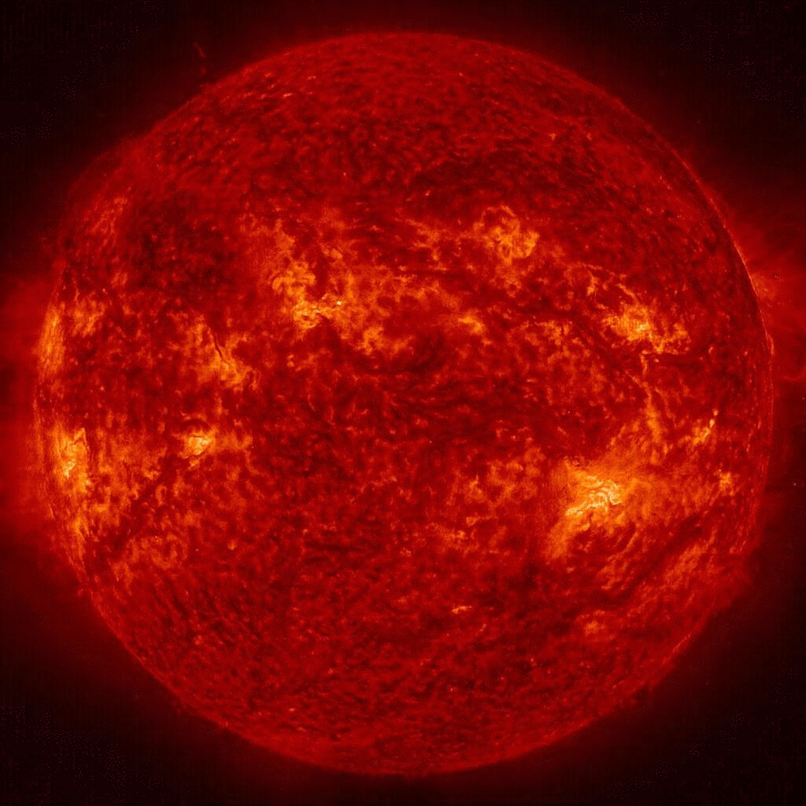
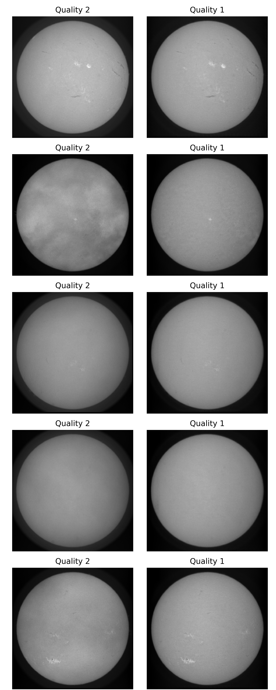
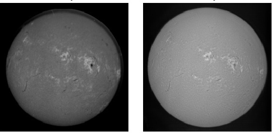
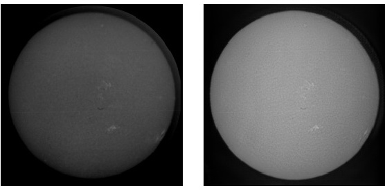

# Instrument to Instrument Translation for Solar Observations

This repository hosts results of the instrument to instrument (ITI) project.

ITI enhances solar observations to the quality of the most recent observations, providing a continuous series of high-quality 
observations over the lifetime of multiple instruments.
The approach is based on the translation between image distributions. A neural network is used to learn the instrument
specific characteristics of high-quality and low-quality observations. For the enhancement of low-quality observations
the knowledge about the high-quality distribution is used to infer missing information.

ITI can be applied for a large variety of data and only requires high- and low-quality images of the same physical observable, without
the need for spatial or temporal aligned pairs. Therefore, this approach can be also used to recover historic observations
(e.g., photographic plates) or enhance observations with the use of simulation data.

ITI provides a full framework, which allows for flexible and easy model training and evaluation. Codes and pre-trained models
 will be made available after publication.

## HMI to Hinode (super-resolution)

*Original HMI*

*Enhanced to Hinode Quality*

*Comparison of a local cutout. Top: original input image, Bottom: result of the ITI network.*

## SOHO to SDO (multi-channel)

*SOHO 171*

*SOHO 193*

*SOHO 211*

*SOHO 304*

## KSO mitigation of atmospheric effects (large scale modifications)

*KSO cloud removal*

## Photgraphic film to CCD

*KSO film*
